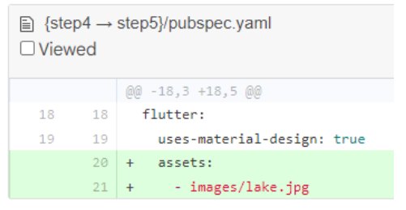
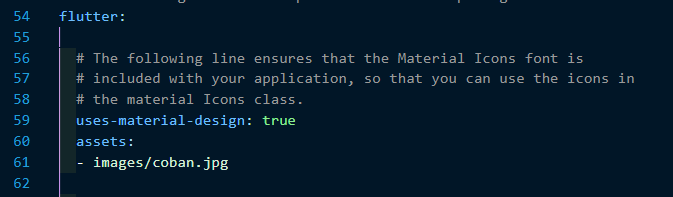
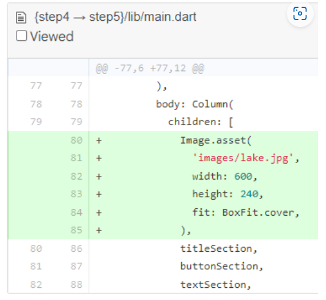
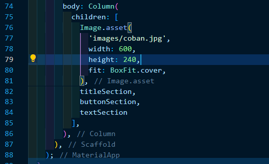
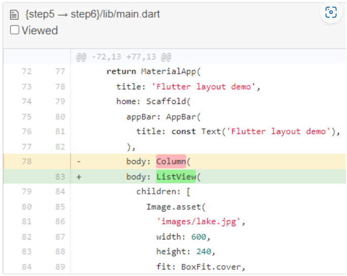
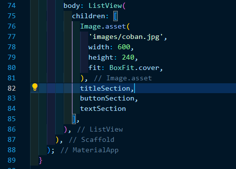
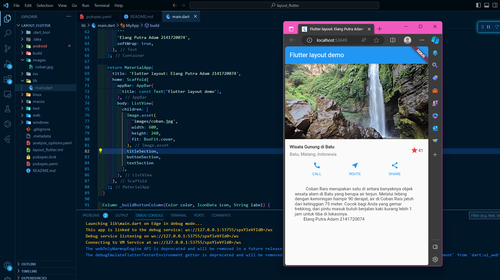

# <b>Laporan Pertemuan 8 - UTS</b>
<b> Nama: Elang Putra Adam

Kelas: TI 3G

NIM: 2141720074 </b>

## <b>Praktikum 4: Implementasi image section</b>

Selesaikan langkah-langkah praktikum berikut ini dengan melanjutkan dari praktikum sebelumnya.

### <b>Langkah 1: Siapkan aset gambar</b>

Anda dapat mencari gambar di internet yang ingin ditampilkan. Buatlah folder images di root project layout_flutter. Masukkan file gambar tersebut ke folder images, lalu set nama file tersebut ke file pubspec.yaml seperti berikut:

Contoh nama file gambar di atas adalah lake.jpg

<b>Jawab:</b>

### <b>Langkah 2: Tambahkan gambar ke body</b>

Tambahkan aset gambar ke dalam body seperti berikut:

BoxFit.cover memberi tahu kerangka kerja bahwa gambar harus sekecil mungkin tetapi menutupi seluruh kotak rendernya.

<b>Jawab:</b>

### <b>Langkah 3: Terakhir, ubah menjadi ListView</b>

Pada langkah terakhir ini, atur semua elemen dalam ListView, bukan Column, karena ListView mendukung scroll yang dinamis saat aplikasi dijalankan pada perangkat yang resolusinya lebih kecil.

<b>Jawab:</b>

<b>Hasil Running:</b>

